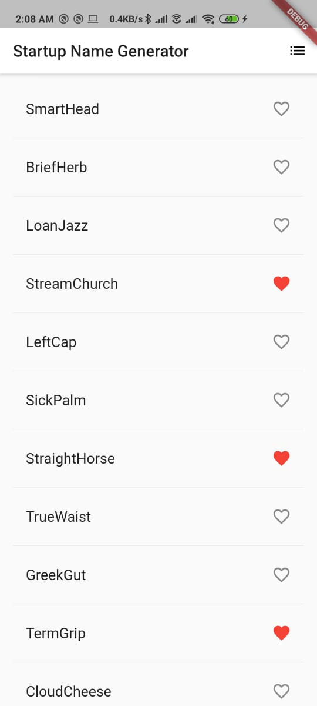

# Startup Namer

A simple mobile app that generates proposed names for a startup company. The user can select and unselect names, saving the best ones. The code lazily generates 10 names at a time. As the user scrolls, new batches of names are generated. The user can scroll forever with new names being continually generated.

## Screenshots

<table>
  <tr>
    <th>Home Page</th>
    <th>Favorites Page</th>
   </tr>
  <tr>
    <td></td>
    <td></td>
   </tr>
 </table>
